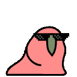
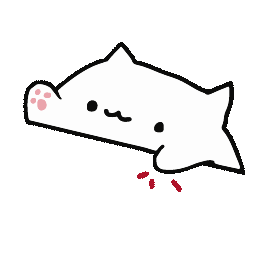
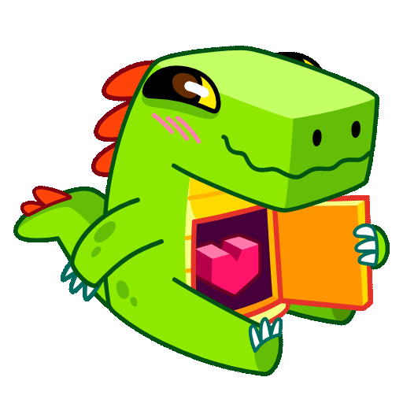

<h2> Hi, I'm Carlos Zalazar! </h2>

<ul>
    <li>👨‍💻 Passionate about backend and frontend development.</li>
    <li>🥂 Let's work together to make our dreams come true.</li>
    <li>🤓 More than 6 years of programming experience.</li>
</ul>

## Skills

- 👨‍💻 Node js, MongoDB, MySql
- ⚙️ React, Vue
- 👁️ Html, CSS, Javascript

 

## Contact

- [My Personal Email](mailto:zalazarc20@gmail.com)
- [zalazarc20](https://www.instagram.com/zalazarc20/) on Instagram.
- [My Server of Discord](https://discord.gg/wEWg6ANtq4)

 
 

<h1 align='center'>⚡️<i>Stay awesome!</i>⚡️</h1>

Thank you for visiting my profile. I'm always open to new opportunities for collaboration and learning. If you want to discuss projects, exchange ideas, or simply chat about web development, feel free to reach out. Together, we can create impactful and creative solutions.

        

