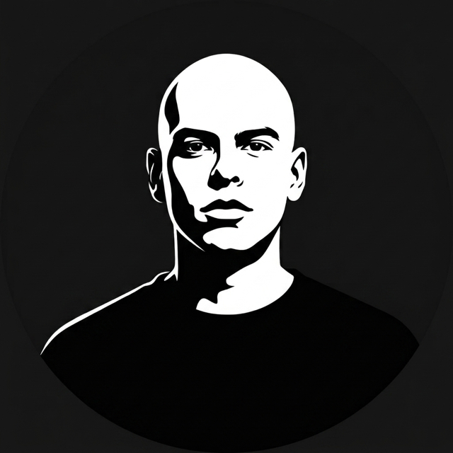

# Carlos Zalazar
### Full-Stack Developer

 

## Stack

## Sobre mí

- Desarrollo backend y frontend end-to-end: React/TypeScript en el cliente, Node.js/NestJS + Prisma + PostgreSQL en el servidor.
- Además del trabajo con clientes, construyo proyectos propios de streaming y TV — Android TV y Flutter.
- Estructuro mis proyectos para trabajar en equipo con agentes de IA: documentación clara, cambios quirúrgicos, entregables listos para usar.
- Siempre abierto a colaborar en proyectos que valgan la pena.

## GitHub Stats

## Conectá conmigo

<!-- Cuando tengas los links de Telegram y Discord, sumá estas líneas siguiendo el mismo patrón:

-->

 

Gracias por pasar por mi perfil — siempre abierto a hablar de proyectos, ideas o simplemente charlar de código.

